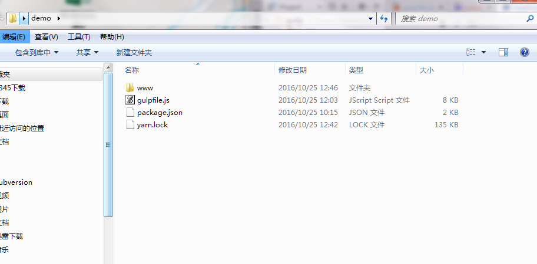
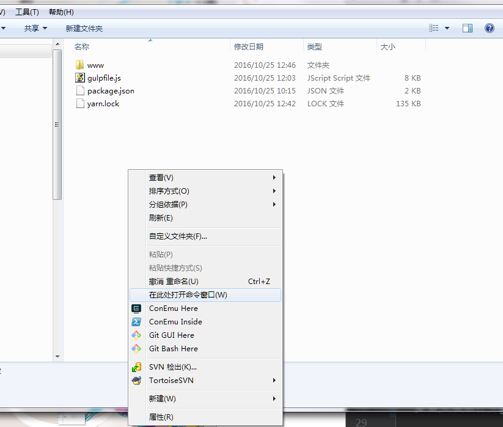
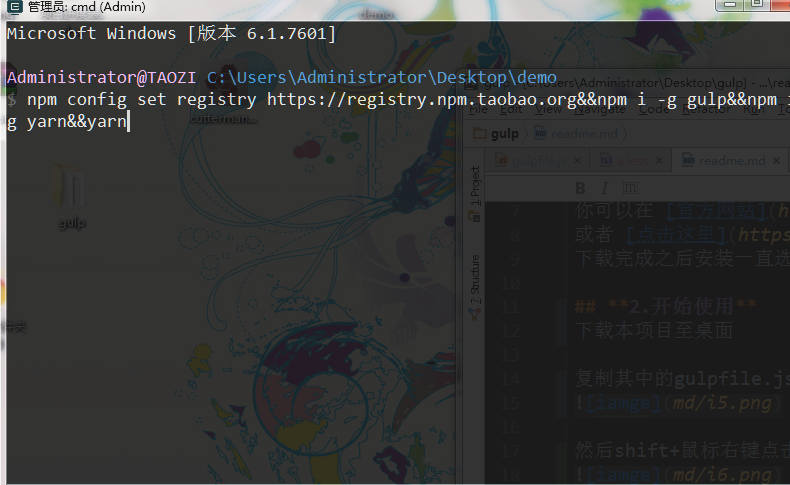
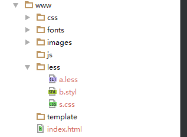
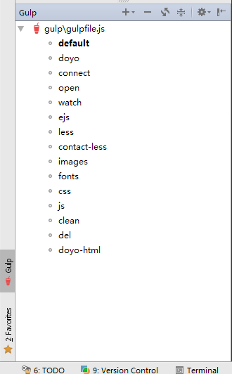

gulp
=
环境准备
-
## **1.安装nodejs**

你可以在 [官方网站](https://nodejs.org/en/) 下载（下载最新版），
下载完成之后安装一直选择下一步即可。

## **2.安装**
下载本项目至桌面

复制其中的gulpfile.js package.json yarn.lock到将要进行的项目中,如下图

然后shift+鼠标右键点击空白处 选择在此处打开命令窗口

+ 之后输入并运行(第一次使用)

       npm config set registry https://registry.npm.taobao.org&&npm i -g gulp&&npm i -g yarn&&yarn
    
 
 
+ 如果你已经不是第一次使用，以后的项目安装只需要输入

        yarn
        
安装完成之后 点击start.cmd运行 或者在命令提示符里输入gulp
    
+ 将会监视www文件夹下的HTML、CSS、JS文件变化，自动编译，自动刷新浏览器。

+ 当HTML或JS发生变化时，浏览器会刷新，当CSS变化时，浏览器会重载CSS文件

+ images、css、fonts文件夹的内容会被监视并在发生变化时被复制到build文件夹对应目录中

## **3.关于SVN**

初次建立项目时，应该包含gulpfile.js、yarn.lock、package.json文件并提交

之后提交时只提交WWW文件夹里面的内容

## **4.实现的功能**

+ HTML 模板引入（ejs模板引擎，具体语法参照 [mde/ejs](https://github.com/mde/ejs)）

        {{header}} 默认后缀为html，目录为template
       
+ 浏览器前缀修复

    当前设置兼容性为 

        browsers: ['last 5 versions', 'IE 6-8', '>2%']
        
        
+ 编译并合并www/less文件夹下的less文件和stylus文件,里面的css文件现在也会被合并，但是不建议使用css

  + 你可以浏览下面网站学习less或stylus。
  
       + [LESS](http://less.bootcss.com/#)  LESS 将 CSS 赋予了动态语言的特性，如 变量， 继承， 运算， 函数. 
  
       + [Stylus](http://stylus-lang.com/) EXPRESSIVE, DYNAMIC, ROBUST CSS
  
  + 由于sass、scss安装难度的问题 没有加入支持，如果你需要此功能，可以在本页面上方Pull requests。

    
+ css优化（cssnano）

+ es2015 语法 babel自动编译，默认关闭

## **5.目录结构**

## **6.各任务简介**

+ 默认任务，编译源代码到build

        gulp
 
+ 最终发布，将会清理html和css模板文件,并且压缩css，js  

        gulp dist
    
+ doyo发布

        gulp doyo

将源代码编译至doyo文件夹，并且替换 ()

         {{header}}
    
    为
    
         {include = "template/header.html" }
         
## **7.额外说明** 
        
+ webstorm   

        默认支持less，stylus可以下载插件支持，webstorm里可以直接运行gulp任务

    
+ sublime   
 
        less，stylus都需要安装插件以支持语法高亮(请自行百度)

